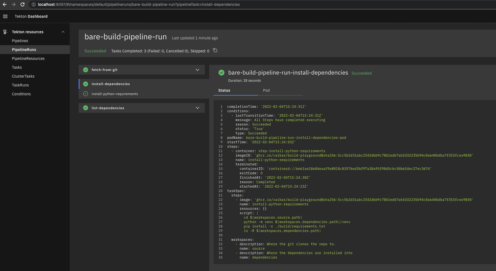

# build-playground

Playground for building an example e2e pipeline using Tekton Pipelines / Chains
for Python.

# Get started


## Local Development 

If you have Mac, run this:

```shell
./hack/setup-mac-kind.sh
```

if not, run this:
```shell
./hack/setup-kind.sh
```

This will set up a kind cluster on your machine with:

 * Knative serving
 * Sigstore (rekor, fulcio, etc.)
 * Tekton Chains / Pipelines
 * Tekton task for fetching github sources

## GCP Development 

Create the GKE Cluster, install Tekton Pipelines, Dashboard and Chains

```bash
make tf_init tf_plan tf_apply
```

Let's make sure we are running on the GKE cluster we just created, switch kubectl context

```bash
gcloud container clusters list
NAME                 LOCATION    MASTER_VERSION   MASTER_IP       MACHINE_TYPE   NODE_VERSION     NUM_NODES  STATUS
chainguard-dev       us-east1-b  1.21.6-gke.1500  35.229.115.236  n1-standard-4  1.21.6-gke.1500  2          RUNNING
chainguard-dev-gke3  us-east1-b  1.21.6-gke.1500  35.185.98.163   n1-standard-4  1.21.6-gke.1500  2          RECONCILING


gcloud container clusters  get-credentials chainguard-dev-gke3

kubectl config get-contexts
CURRENT   NAME                                                CLUSTER                                             AUTHINFO                                            NAMESPACE
          gke_chainguard-dev_us-east1-b_chainguard-dev        gke_chainguard-dev_us-east1-b_chainguard-dev        gke_chainguard-dev_us-east1-b_chainguard-dev        
*         gke_chainguard-dev_us-east1-b_chainguard-dev-gke3   gke_chainguard-dev_us-east1-b_chainguard-dev-gke3   gke_chainguard-dev_us-east1-b_chainguard-dev-gke3   
          kind-kind                                           kind-kind                                           kind-kind                                           

kubectl config use-context gke_chainguard-dev_us-east1-b_chainguard-dev-gke3
Switched to context "gke_chainguard-dev_us-east1-b_chainguard-dev-gke3".
```

Run

    ./hack/setup-gcp.sh 

This will install knative services onto the cluster

Then 

Installs fulcio and rekor, with a mysql backend running the cluster via ./hack/gke/release-arm-gke.yaml

And finally test the installation with ./hack/gke/testrelease-gke.yaml

Runs two jobs, one for checking the ctlog tree and one for verifying OIDC signing

```bash
 kubectl get pods
NAME               READY   STATUS      RESTARTS   AGE
check-oidc-sl42c   0/1     Completed   0          19m
checktree-828rg    0/1     Completed   0          19m
checktree-8kmxd    0/1     Error       0          19m
checktree-tvbkl    0/1     Error       0          19m
```

```bash
kubectl logs checktree-828rg
2022/02/04 14:37:09 Got Payload: map[9ea3cde144cf9277764e1c96b70d8fc03c2370ba25a3010a65d5dcf5535cae83:{Attestation:<nil> Body:BASE64DATA IntegratedTime:0xc000129688 LogID:0xc00010d1f0 LogIndex:0xc000129720 Verification:0xc0001344a0}]


kubectl logs check-oidc-sl42c

Generating ephemeral keys...
Retrieving signed certificate...
**Warning** Using a non-standard public key for verifying SCT: /var/run/sigstore-root/rootfile.pem
Successfully verified SCT...
tlog entry created with index: 0
Pushing signature to: chainguard-dev/nginx 
```

If there are any issues with the installation you can use ./hack/gke/test-gke-user.yaml 

Testing rekor 

```bash
 curl http://rekor.rekor-system.svc/api/v1/log/
{
  "rootHash":"e3b0c44298fc1c149afbf4c8996fb92427ae41e4649b934ca495991b7852b855",
  "signedTreeHead":"Rekor\n0\n47DEQpj8HBSa+/TImW+5JCeuQeRkm5NMpJWZG3hSuFU=\nTimestamp: 1644340477773818665\n\n— rekor.sigstore.dev LJZ0/DBFAiBkWCXKJWbDUzwozFh0HO8flMJu40Bdd5wpf/p2yF0brgIhAMx+Csi20A25zziQuacUaCKWBXpkG52Br0eKgcNrKzjI\n",
  "treeSize":0
}
```

Verifying OIDC token 

```bash
cat /var/run/sigstore/cosign/oidc-token
SA_TOKEN_INFOMATION
```

# Tekton Overview

We also have an image that we create. Idea is that it's a blessed python-slim
version that will only be used to install the requirements. After the
installation completes, we grab the dependencies and just copy them to the
venv for the python that will then actually run them.

# Once you've installed the bits above, you can install the config pieces.

# Install Dockerfile that Kaniko will use to build the app image
```bash
kubectl create configmap dockerfile --from-file=./docker/build-app/Dockerfile
```

# Install all the tasks that we have produced
```shell
kubectl apply -f ./config/common/
```

GKE 
```shell
kubectl apply -f ./config/gke/
```

OR 

Local
```shell
kubectl apply -f ./config/kind/
```


And then the pipeline should complete successfully, you can follow along:

```shell
kubectl get pipelineruns -w
```

If you have tekton dashboard installed 

```bash
kubectl port-forward svc/tekton-dashboard 9097:9097 -n tekton-pipelines
```


