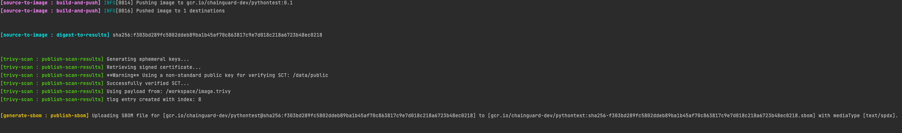

# Sigstore HPE POC

Local development environment for exercising Tekton and Sigstore running on kind. There are two example pipelines, one for Python and one for Go.

**Note**: We have to use `--allow-insecure-registry` due to this [cosign bug](https://github.com/sigstore/cosign/issues/1405).

## Notes for MacOS

The airplay receiver uses port 5000, which may need to be disabled. Further details via [Apple's developer forum](https://developer.apple.com/forums/thread/682332). Alternatively, you can manually modify the script and change the [REGISTRY_PORT](https://github.com/vaikas/sigstore-scaffolding/blob/main/hack/setup-mac-kind.sh#L19)

# Prerequisites

In order to run through this example, you will need the following installed. For
Windows installation, the tools will get installed in the WSL (see link below)
and in particular, I tested this with installing Ubuntu 20.04 LTS. Then all
the commands are executed in that environment. Also for Windows, you will need
to install Windows Docker desktop after which you will need to install Docker
cli on the Linux subsystem.

 * [Docker](https://docs.docker.com/get-docker/)
 * **Windows Only** [WSL](https://docs.microsoft.com/en-us/windows/wsl/install)
 * [tkn cli](https://tekton.dev/docs/cli/)
 * [kubectl](https://kubernetes.io/docs/tasks/tools/)
 * [rekor-cli](https://docs.sigstore.dev/rekor/installation/)
 * [cosign](https://github.com/sigstore/cosign/releases)
 * [yq](https://github.com/mikefarah/yq#install)
 * [jq](https://stedolan.github.io/jq/download/)

# Setup Kubernetes cluster

We will setup the local Kubernetes cluster by running the `/hack/kind/setup-kind.sh` script from the root of this repository.

```shell
./hack/kind/setup-kind.sh
```

This script will set up a local Kubernetes kind cluster on your machine with:

 * Knative serving
 * sigstore (Rekor, Fulcio, etc.)
 * Tekton Chains / Pipelines
 * Tekton task for fetching GitHub sources

This setup will take a few minutes. Note that you will be prompted for your root
password while running the setup script. This is needed on Linux for turning off
swap as well as mounting a Ram disk. For others, we add a local registry entry
into /etc/hosts.

**Note**: You may see some errors similar to the following while the script is running. This is fine.

```
Error from server (InternalError): error when creating "https://storage.googleapis.com/tekton-releases/chains/latest/release.yaml": Internal error occurred: failed calling webhook "config.webhook.pipeline.tekton.dev": Post "https://tekton-pipelines-webhook.tekton-pipelines.svc:443/config-validation?timeout=10s": dial tcp 10.96.244.5:443: connect: connection refused
```

They are due to some race conditions when installing Tekton components. There
are retries built in, so as long things finish, it's ok. Cleaning those up will
require some upstream work.

Once you get output that ends in the `::endgroup::` line, you'll know this
initial setup is completed. The last few lines of the output should resemble the
following.

```
...
configmap/dashboard-info created
service/tekton-dashboard created
deployment.apps/tekton-dashboard created
clusterrolebinding.rbac.authorization.k8s.io/tekton-dashboard-tenant created
::endgroup::
```

If you run `docker ps -a` at this point, you should have 3 containers, including a `registry.local`, a `sigstore-worker`, and a `sigstore-control-plane`.

### Verify sigstore installs

There are two jobs that run to verify the installation. The first is `check-oidc` which signs an image with Cosign, and the second is `checktree` which ensures it's properly added to the Rekor transparency log. Both of them should show `1/1` completions.

```bash
kubectl get jobs
```

```
NAME         COMPLETIONS   DURATION   AGE
check-oidc   1/1           40s        9m19s
checktree    1/1           59s        9m19s
```

You can get the completed pod logs next.

```bash
for i in `kubectl get pods | grep Completed | awk -F " " '{print $1}'`
do
kubectl logs $i
done
```

A small snippet of the output you get should be similar to the following.

```
Generating ephemeral keys...
Retrieving signed certificate...
**Warning** Using a non-standard public key for verifying SCT: /var/run/sigstore-root/rootfile.pem
Successfully verified SCT...
tlog entry created with index: 0
Pushing signature to: knative
2022/02/10 22:57:56 Got Payload: map[e0beca4...vdExTMHRMVVZPUkNCRFJWSlVTVVpKUTBGVVJTMHRMUzB0Q2c9PSJ9fX19 IntegratedTime:0x4000135588 LogID:0x400001e8e0 LogIndex:0x40001355a0 Verification:0x400002a860}]
2022/02/10 22:57:56 Found UUID: e0beca412f78687deef90f1e7aacbe022d0968ec9c12dd36fb7374f0102e08a8
2022/02/10 22:57:56 Checking for type: hashedrekord version 0.0.1
2022/02/10 22:57:56 Got TYPE: &{HashedRekordObj:{Data:0x400012e980 Signature:0x4000591f00} keyObj:0x4000126d20 sigObj:0x4000126c90}
2022/02/10 22:57:56 Searching for sha256:cad43a8a48728336a6606d7bfecc7aa84b032b1dd951b5ec287cfd4597b22603
2022/02/10 22:57:56 Found index entry: e0beca412f78687deef90f1e7aacbe022d0968ec9c12dd36fb7374f0102e08a8
```

At this point, we can move onto Tekton.

# Tekton overview

[Tekton](https://tekton.dev/) is an open-source framework for building CI/CD
systems that we use to demonstrate setting up SLSA compliant environment.

## Network access

We will need to setup port forwarding at this point, so that our tools can run
against the services on the kind cluster.

```shell
kubectl -n kourier-system port-forward service/kourier-internal 8080:80 &
```

### Adding localhost entries to make tools usable

First, add the following entries to your `/etc/hosts` file:

```
127.0.0.1 rekor.rekor-system.svc
127.0.0.1 fulcio.fulcio-system.svc
127.0.0.1 ctlog.ctlog-system.svc
```

This makes using tooling easier, for example using curl:

```bash
curl http://rekor.rekor-system.svc:8080/api/v1/log/ | jq -r .
```

Running the above should generate output that resembles the following.

```
{
  "rootHash": "2ff1d12e293267b3ad3ee728e0cf3f07d34c19a32dba444ca01f11981c0f7f9f",
  "signedTreeHead": "Rekor\n1\nL/HRLikyZ7OtPuco4M8/B9NMGaMtukRMoB8RmBwPf58=\nTimestamp: 1645646556828349221\n\n— rekor.sigstore.dev VWCOczBEAiBl7W6/nhXqokcTsp+rLT5X9nsxljBwbFhKKn+0Bs4qxgIgaELEBelPnXwSh1vd0WP/npMelzK9cEHxn/rpYkOV9oE=\n",
  "treeSize": 1
}
```

And using rekor-cli:

```shell
rekor-cli --rekor_server http://rekor.rekor-system.svc:8080 loginfo
```

After smoke tests have successfully completed, you'll receive output similar to this:

```
No previous log state stored, unable to prove consistency
Verification Successful!
Tree Size: 1
Root Hash: 062e2fa50e2b523f9cfd4eadc4b67745436226d64bf9799d57c5dc023681c4b8
Timestamp: 2022-02-04T22:09:46Z
```

If you run through this example more than once, you can remove the `/.rekor/state.json` file in order to get verification output again. Or alternatively you can invoke rekor-cli with `--store_tree_state=false` flag. Otherwise rekor-cli will complain that the state of the tree is suspect (which it is, since we recreated it :) ).

### Certificates

There are two certificates that we need; the CT Log and Fulcio root certs. Note that if you are switching back and forth between public and your instance, you may not want to export these variables (or unexport them when switching to public instances).

Get the CT Log public certificate:

```shell
kubectl -n ctlog-system get secrets ctlog-public-key -o=jsonpath='{.data.public}' | base64 -d > ./ctlog-public.pem
export SIGSTORE_CT_LOG_PUBLIC_KEY_FILE=./ctlog-public.pem
```

Now get the Fulcio root certificate:

```shell
kubectl -n fulcio-system get secrets fulcio-secret -ojsonpath='{.data.cert}' | base64 -d > ./fulcio-root.pem
export SIGSTORE_ROOT_FILE=./fulcio-root.pem
```

# Running through Tekton tasks

Once you've installed the above, you can install the Tekton task and pipeline pieces. This is a very rough beginning of a proper Python pipeline and is meant to demonstrate breaking the large build into multiple steps and providing attestations at each level via Tekton Chains.

## Install tasks and pipelines

Run the following with `kubectl` to install all the tasks that are needed for the pipeline

```shell
kubectl apply -f ./config/common/
kubectl apply -f ./config/python/
kubectl apply -f ./config/go/
```

After these tasks are created, check to ensure what is installed.

```shell
kubectl get tasks,pipelines
```

Ensure that your output matches the following tasks and pipelines.

```
NAME                                          AGE
task.tekton.dev/git-clone                     61s
task.tekton.dev/install-go-dependencies       38s
task.tekton.dev/install-python-dependencies   44s
task.tekton.dev/kaniko                        61s
task.tekton.dev/ko-build-image                38s
task.tekton.dev/list-dependencies             61s
task.tekton.dev/sbom-syft                     61s
task.tekton.dev/scan-trivy                    61s
task.tekton.dev/sign-image                    61s

NAME                                        AGE
pipeline.tekton.dev/go-build-pipeline       38s
pipeline.tekton.dev/python-build-pipeline   44s
```

We'll run the Python pipeline next.

## Run Python pipeline

Run the python pipeline like so:

```shell
kubectl apply -f ./config/kind/python-pipelinerun-kind.yaml
```

The pipeline should complete successfully, which you can follow along by checking the pipeline runs.

```shell
kubectl get pipelineruns -w
```

After a while it should succeed like this:
```
bare-build-pipeline-run   True        Succeeded   6h13m       6h12m
```

## Inspect results

As part of the pipeline run we create a container image for it, sign it with Cosign, create an SBOM, and perform a Trivy scan for it.

To review the concise and clear overview of the pipeline run, use the tkn cli.

```
tkn pr describe bare-build-pipeline-run
```

The output from above should look something like this:
```
Name:              bare-build-pipeline-run
Namespace:         default
Pipeline Ref:      python-build-pipeline
Service Account:   default
Timeout:           1h0m0s
Labels:
 tekton.dev/pipeline=python-build-pipeline

🌡️  Status

STARTED       DURATION   STATUS
6 hours ago   1 minute   Succeeded

⚓ Params

 NAME                                VALUE
 ∙ git-url                           https://github.com/vaikas/hellopython.git
 ∙ git-revision                      main
 ∙ imageUrl                          registry.local:5000/knative/pythontest
 ∙ SIGSTORE_CT_LOG_PUBLIC_KEY_FILE   /data/ctlog-public.pem
 ∙ imageTag                          0.1
 ∙ REQUIREMENTSFILE                  requirements.txt
 ∙ DOCKERFILE                        ./source/docker/Dockerfile
 ∙ fulcio-endpoint                   http://fulcio.fulcio-system.svc
 ∙ rekor-endpoint                    http://rekor.rekor-system.svc

📝 Results

 NAME             VALUE
 ∙ IMAGE-DIGEST   sha256:ef3a2828fa01e9d4b1e42a4e89cc02f0a447797fa7b94abc937f6573e34e5710

📂 Workspaces

 NAME             SUB PATH   WORKSPACE BINDING
 ∙ git-source     ---        PersistentVolumeClaim (claimName=shared-task-storage)
 ∙ dependencies   ---        PersistentVolumeClaim (claimName=python-dependencies-storage)

🗂  Taskruns

 NAME                                             TASK NAME              STARTED       DURATION     STATUS
 ∙ bare-build-pipeline-run-trivy-scan             trivy-scan             6 hours ago   16 seconds   Succeeded
 ∙ bare-build-pipeline-run-generate-sbom          generate-sbom          6 hours ago   10 seconds   Succeeded
 ∙ bare-build-pipeline-run-sign-image             sign-image             6 hours ago   9 seconds    Succeeded
 ∙ bare-build-pipeline-run-source-to-image        source-to-image        6 hours ago   20 seconds   Succeeded
 ∙ bare-build-pipeline-run-list-dependencies      list-dependencies      6 hours ago   6 seconds    Succeeded
 ∙ bare-build-pipeline-run-install-dependencies   install-dependencies   6 hours ago   13 seconds   Succeeded
 ∙ bare-build-pipeline-run-fetch-from-git         fetch-from-git         6 hours ago   8 seconds    Succeeded
```


You can review the digest in the **Results** section. To reduce cutting and pasting, let's grab it into an `ENV` variable for later steps:

```shell
IMAGE_ID=$(kubectl get taskruns bare-build-pipeline-run-source-to-image -o jsonpath='{.spec.params[0].value}' | awk -F ":" '{print $1":"$2}')@$(kubectl get taskruns bare-build-pipeline-run-source-to-image -o jsonpath='{.status.taskResults[0].value}')
```

You can inspect the IMAGE_ID that was created with:

```shell
echo $IMAGE_ID
```

This should output something like so:
```
registry.local:5000/knative/pythontest@sha256:aebbd2977c66b5a5f53fe9af2a52ae129203e560cb7480930535124874a6e3b1
```

Verify the image was built correctly:
```
docker run $IMAGE_ID
```

You should see something like this:
```
Unable to find image 'registry.local:5000/knative/pythontest@sha256:ef3a2828fa01e9d4b1e42a4e89cc02f0a447797fa7b94abc937f6573e34e5710' locally
registry.local:5000/knative/pythontest@sha256:ef3a2828fa01e9d4b1e42a4e89cc02f0a447797fa7b94abc937f6573e34e5710: Pulling from knative/pythontest
927a35006d93: Already exists
5cbfa4e6f5b5: Already exists
959a6776893a: Already exists
cf92abb5f192: Already exists
2c067721f313: Already exists
318918a7be9b: Pull complete
48ad511cde95: Pull complete
1a9840e34540: Pull complete
b432ae5a0abc: Pull complete
Digest: sha256:ef3a2828fa01e9d4b1e42a4e89cc02f0a447797fa7b94abc937f6573e34e5710
Status: Downloaded newer image for registry.local:5000/knative/pythontest@sha256:ef3a2828fa01e9d4b1e42a4e89cc02f0a447797fa7b94abc937f6573e34e5710


    XX  XX  XX  XX  XX  XX  XX  XX  XX  XX
    XX  XX  XX  XXXX    XX  XX      XX  XXXX
    XXXX  XX    XX    XXXX    XXXXXX    XX
    XX    XXXX      XXXX  XXXX        XX  XX
    XX    XX    XXXX      XX  XX
    XXXXXX  XX  XX  XX  XXXX  XXXXXX    XXXX
    XXXX  XX          XXXX  XXXX    XX  XX
    XXXX      XX  XXXXXX  XXXX        XXXXXX
    XX    XX      XX  XXXXXX    XX  XX  XX
    XX  XX    XXXX  XX  XXXX    XXXXXX    XX
    XXXX      XX  XX    XXXX  XXXXXX  XX
    XX  XX  XXXXXX  XX    XX  XXXX  XX    XX
    XX          XX      XXXX  XX  XXXXXXXX
    XXXXXX  XXXXXX  XXXX  XXXXXXXXXXXX    XX
    XX  XXXXXX  XX    XX      XXXXXXXX
    XX    XX    XX  XX  XX    XXXXXXXXXX  XX
    XX  XXXXXXXX  XX    XXXXXX  XX  XX  XX
    XX  XX        XXXX  XX  XXXX  XX      XX
    XXXX  XX  XXXX    XX      XX  XXXX
    XXXXXXXXXXXXXXXXXXXXXXXXXXXXXXXXXXXXXXXX
```


Verify that the image was signed.

```shell
COSIGN_EXPERIMENTAL=1 cosign verify --allow-insecure-registry --rekor-url=http://rekor.rekor-system.svc:8080 --allow-insecure-registry $IMAGE_ID
```

After running the above, you should get output similar to this.

```
Verification for registry.local:5000/knative/pythontest@sha256:63ac5cfea7d421d92635f97e9e014b5ceed0613566d52111f990b6076e564905 --
The following checks were performed on each of these signatures:
  - The cosign claims were validated
  - The claims were present in the transparency log
  - The signatures were integrated into the transparency log when the certificate was valid
  - Any certificates were verified against the Fulcio roots.

  [{"critical":{"identity":{"docker-reference":"registry.local:5000/knative/pythontest"},"image":{"docker-manifest-digest":"sha256:63a<SNIPPED HERE FOR READABILITY>
```

Now, let's download the SBOM.

```shell
COSIGN_EXPERIMENTAL=1 cosign download sbom --allow-insecure-registry $IMAGE_ID > /tmp/sbom
```

You can look at the `/tmp/sbom` file and it should look like this:

```
SPDXVersion: SPDX-2.2
DataLicense: CC0-1.0
SPDXID: SPDXRef-DOCUMENT
DocumentName: registry.local:5000/knative/pythontest@sha256:aebbd2977c66b5a5f53fe9af2a52ae129203e560cb7480930535124874a6e3b1
DocumentNamespace: https://anchore.com/syft/image/registry.local:5000/knative/pythontest@sha256:aebbd2977c66b5a5f53fe9af2a52ae129203e560cb7480930535124874a6e3b1
LicenseListVersion: 3.14
Creator: Organization: Anchore, Inc
Creator: Tool: syft-[not provided]
Created: 2022-02-17T16:08:11Z
.......
```

Get the Trivy scan result.

```shell
COSIGN_EXPERIMENTAL=1 cosign verify-attestation --rekor-url=http://rekor.rekor-system.svc:8080 --allow-insecure-registry $IMAGE_ID > /tmp/attestations
```

Finally, you should get this output that verifies everything was validated.

```shell
Verification for gcr.io/chainguard-dev/pythontest@sha256:c089acd03a21830c329d70f61cefa2a29c43e59ebc848581043b631451dfffa7 --
The following checks were performed on each of these signatures:
  - The cosign claims were validated
  - The claims were present in the transparency log
  - The signatures were integrated into the transparency log when the certificate was valid
  - Any certificates were verified against the Fulcio roots.
```

Verify the Tekton Chains by choosing one of the steps. We can do this for any of the taskruns, but let's do the one that does the build. Tekton stores this information in the Taskrun annotations, so let's pull out the transparency entry.

```shell
kubectl get taskruns bare-build-pipeline-run-source-to-image -ojsonpath='{.metadata.annotations.chains\.tekton\.dev/transparency}'
```

This should print something similar to the following.

```
kubectl get taskruns bare-build-pipeline-run-source-to-image -ojsonpath='{.metadata.annotations.chains\.tekton\.dev/transparency}'
http://rekor.rekor-system.svc/api/v1/log/entries?logIndex=40%
```

We can then fetch the corresponding entry from the Rekor log with:

```shell
TRANSPARENCY_INDEX=$(kubectl get taskruns bare-build-pipeline-run-source-to-image -ojsonpath='{.metadata.annotations.chains\.tekton\.dev/transparency}' | awk -F "=" '{print $2}')
rekor-cli --rekor_server http://rekor.rekor-system.svc:8080 get --log-index $TRANSPARENCY_INDEX > /tmp/transparency
```

We can then look at that file with `less`/`vi` and we can format the actual attestation nicely with this:

```shell
grep Attestation /tmp/transparency | awk -F " " '{print $2}' | base64 -d | jq -r .
```

The above should print something like this:

```shell
{
  "_type": "https://in-toto.io/Statement/v0.1",
  "predicateType": "https://slsa.dev/provenance/v0.2",
  "subject": null,
  "predicate": {
    "builder": {
      "id": "https://tekton.dev/chains/v2"
    },
.......
```

Chains also adds the signature and payload to annotations of a taskrun, and you can pull them out like this:

```shell
TASKRUN_UID=$(kubectl get taskruns bare-build-pipeline-run-source-to-image -ojsonpath='{.metadata.uid}')
tkn tr describe --last -o jsonpath="{.metadata.annotations.chains\.tekton\.dev/signature-taskrun-$TASKRUN_UID}" > signature
tkn tr describe --last -o jsonpath="{.metadata.annotations.chains\.tekton\.dev/payload-taskrun-$TASKRUN_UID}" | base64 -d > payload
```

***TODO(vaikas): THIS STEP DOES NOT WORK YET WITH INDEXING ISSUES***
Then you can verify the integrity by running cosign again:

```
COSIGN_EXPERIMENTAL=1 cosign verify-blob --rekor-url=http://rekor.rekor-system.svc:8080 --allow-insecure-registry --signature ./signature ./payload
```

# Additional Tekton resources + tips

**note for MacOS users** You may hit file limits; you can run
```
sudo launchctl limit maxfiles 65536 200000
```
to remediate that issue.

The above is the "speed run" of the tools and validate that you're up and
running. While doing development work for your own Pipelines, here are ways to
to get more insights into running pipelines.

You can view the logs of the pipeline run with the
[tkn cli](https://tekton.dev/docs/cli/). The -f flag streams them in realtime.

```shell
tkn pipelineruns logs bare-build-pipeline-run -f
```

Since we also installed Tekton dashboard, you can also run the below to view it.

```bash
kubectl port-forward svc/tekton-dashboard 9097:9097 -n tekton-pipelines &
```

Then open your browser to [http://localhost:9097](http://localhost:9097)


When the pipeline finishes, you'll receive the following output in the logs.

```shell
[source-to-image : build-and-push] INFO[0008] Pushing image to registry.local:5000/knative/pythontest:0.1
[source-to-image : build-and-push] INFO[0010] Pushed image to 1 destinations


[source-to-image : digest-to-results] sha256:824e9a8a00d5915bc87e25316dfbb19dbcae292970b02a464e2da1a665c7d54b
```




# Cleaning up

To clean up the cluster as well as a local Docker registry daemon container, run `/hack/kind/teardown-kind.sh` script from the root of this repository.

```shell
./hack/kind/teardown-kind.sh
```
